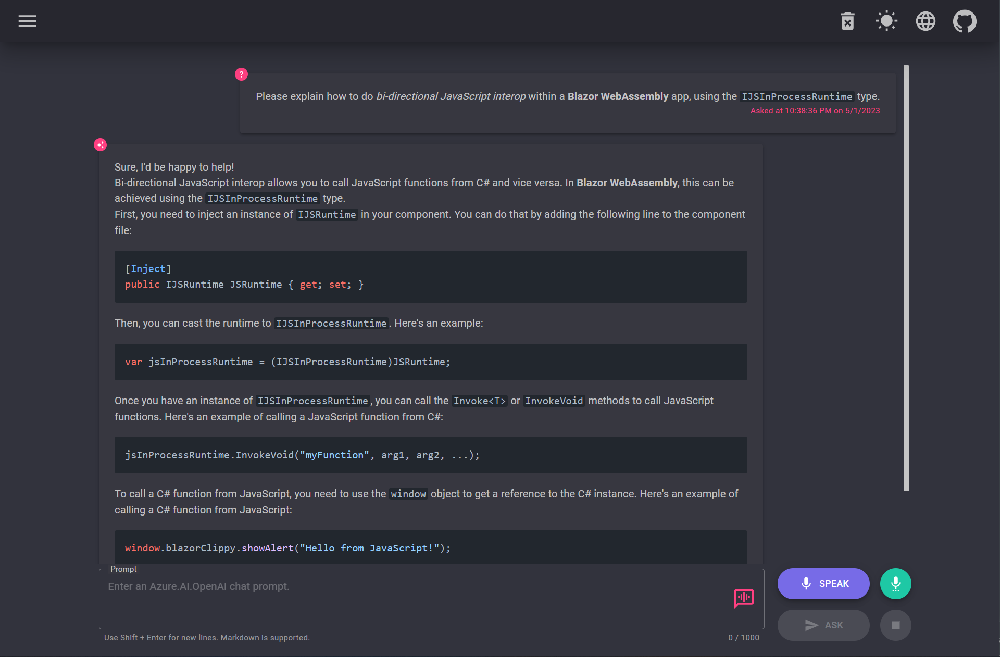

# Blazor 💜 OpenAI

[](https://github.com/IEvangelist/blazor-azure-openai/actions/workflows/dotnet.yml)

## Getting Started

> **NOTE:** 
> To run this example, you'll need an **Azure subscription with access enabled for the Azure OpenAI service**. You can request access [here](https://aka.ms/oaiapply). You can also visit [here](https://azure.microsoft.com/free/cognitive-search/) to get some free Azure credits to get you started.

This example relies on three environment variables:

```PowerShell
setx AzureOpenAI__ApiKey "<Your Azure OpenAI API Key>"
setx AzureOpenAI__ApiEndpoint "<Your Azure OpenAI API endpoint>"
setx AzureOpenAI__DeploymentId "<Your Azure OpenAI deploymend id>"
```

```bash
export AzureOpenAI__ApiKey="<Your Azure OpenAI API Key>"
export AzureOpenAI__ApiEndpoint="<Your Azure OpenAI API endpoint>"
export AzureOpenAI__DeploymentId="<Your Azure OpenAI deploymend id>"
```

## Home screen


## Voice chat screen


## Voice chat screen with navigation menu collapsed


## Text-to-speech preferences dialog displayed


## Example response text



## Example response text continued


